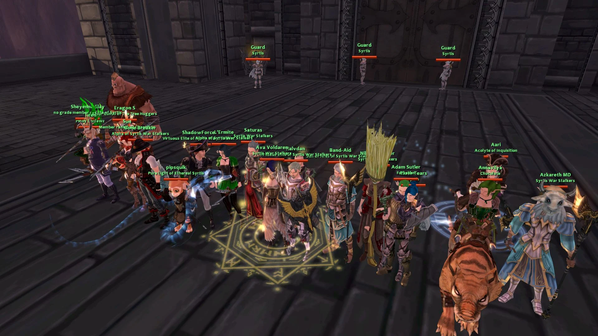
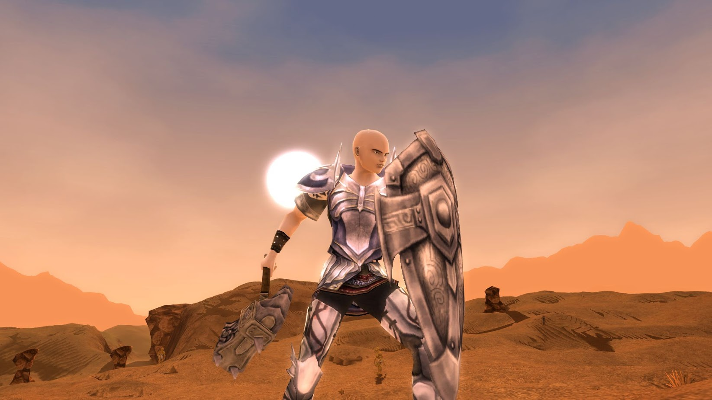
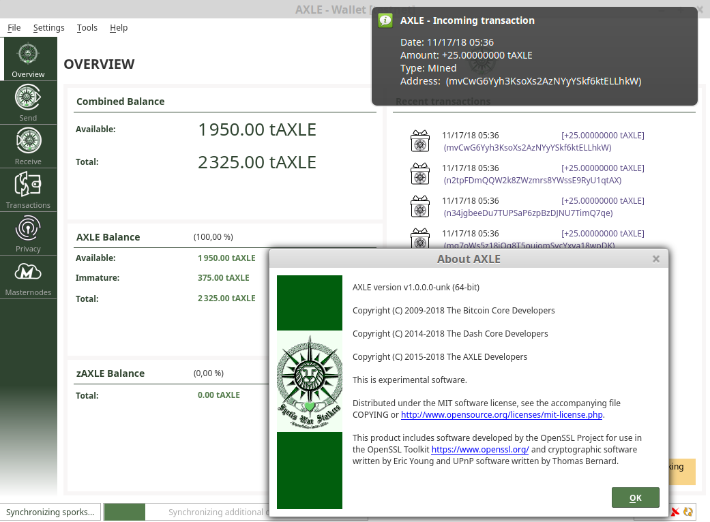

AXLE Coin
=========

_AXLE_ is an open source crypto-currency focused on fast private transactions with low transaction fees & environmental footprint.  It utilizes a custom _Proof of Stake_ protocol for securing its network and uses an innovative variable seesaw reward mechanism that dynamically balances 90% of its block reward size between masternodes and staking nodes and 10% dedicated for budget proposals. The goal of _AXLE_ is to achieve a decentralized sustainable crypto-currency with near instant full-time private transactions, fair governance and community intelligence.
- Anonymized transactions using the [_Zerocoin Protocol_](http://zerocoin.org/).
- Fast transactions featuring guaranteed zero confirmation transactions, we call it _SwiftX_.
- Decentralized blockchain voting utilizing _Masternode_ technology to form a _DAO_. The blockchain will distribute monthly treasury funds based on successful proposals submitted by the community and voted on by the _DAO_.

_AXLE_ Coin is dedicated to _Titanium Axle_, a brave knight of 60 level, a founder, and a leader of _Syrtis War Stalkers_ clan.

 <i>Syrtis War Stalkers clan</i>

 <i>Syrtis War Stalkers clan's logo</i>

 <i>Titanium Axle in Ignis desert</i>

 <i>AXLE wallet's screenshot</i>

More information at [syrtiswarstalkers.blogspot.com](https://syrtiswarstalkers.blogspot.com), an official site of _Syrtis War Stalkers_ (_SWS_) clan @ _Syrtis_ realm @ _Haven_ world @ [Champions of Regnum](https://www.championsofregnum.com/) MMO game.

### Coin Specs
<table>
<tr><td>Algo</td><td>Quark</td></tr>
<tr><td>Block Time</td><td>60 Seconds</td></tr>
<tr><td>Difficulty Retargeting</td><td>Every Block</td></tr>
<tr><td>Max Coin Supply (PoW Phase)</td><td>43,199,500 AXLE</td></tr>
<tr><td>Max Coin Supply (PoS Phase)</td><td>Infinite</td></tr>
<tr><td>Premine</td><td>60,000 AXLE*</td></tr>
</table>

*60,000 _AXLE_ premine will be burned in block #279917.

### Reward Distribution

<table>
<th colspan=4>Genesis Block</th>
<tr><th>Block Height</th><th>Reward Amount</th><th>Notes</th></tr>
<tr><td>1</td><td>60,000 AXLE</td><td>Initial Pre-mine, burnt in block #279917</td></tr>
</table>

### PoW Rewards Breakdown

<table>
<th>Block Height</th><th>Masternodes</th><th>Miner</th><th>Budget</th>
<tr><td>2-43200</td><td>20% (50 AXLE)</td><td>80% (200 AXLE)</td><td>N/A</td></tr>
<tr><td>43201-151200</td><td>20% (50 AXLE)</td><td>70% (200 AXLE)</td><td>10% (25 AXLE)</td></tr>
<tr><td>151201-259200</td><td>45% (22.5 AXLE)</td><td>45% (22.5 AXLE)</td><td>10% (5 AXLE)</td></tr>
</table>

### PoS Rewards Breakdown

<table>
<th>Phase</th><th>Block Height</th><th>Reward</th><th>Masternodes & Stakers</th><th>Budget</th>
<tr><td>Phase 1</td><td>259201-302399</td><td>50 AXLE</td><td>90% (45 AXLE)</td><td>10% (5 AXLE)</td></tr>
<tr><td>Phase 2</td><td>302400-345599</td><td>45 AXLE</td><td>90% (40.5 AXLE)</td><td>10% (4.5 AXLE)</td></tr>
<tr><td>Phase 3</td><td>345600-388799</td><td>40 AXLE</td><td>90% (36 AXLE)</td><td>10% (4 AXLE)</td></tr>
<tr><td>Phase 4</td><td>388800-431999</td><td>35 AXLE</td><td>90% (31.5 AXLE)</td><td>10% (3.5 AXLE)</td></tr>
<tr><td>Phase 5</td><td>432000-475199</td><td>30 AXLE</td><td>90% (27 AXLE)</td><td>10% (3 AXLE)</td></tr>
<tr><td>Phase 6</td><td>475200-518399</td><td>25 AXLE</td><td>90% (22.5 AXLE)</td><td>10% (2.5 AXLE)</td></tr>
<tr><td>Phase 7</td><td>518400-561599</td><td>20 AXLE</td><td>90% (18 AXLE)</td><td>10% (2 AXLE)</td></tr>
<tr><td>Phase 8</td><td>561600-604799</td><td>15 AXLE</td><td>90% (13.5 AXLE)</td><td>10% (1.5 AXLE)</td></tr>
<tr><td>Phase 9</td><td>604800-647999</td><td>10 AXLE</td><td>90% (9 AXLE)</td><td>10% (1 AXLE)</td></tr>
<tr><td>Phase X</td><td>648000-Infinite</td><td>5 AXLE</td><td>90% (4.5 AXLE)</td><td>10% (0.5 AXLE)</td></tr>
</table>
